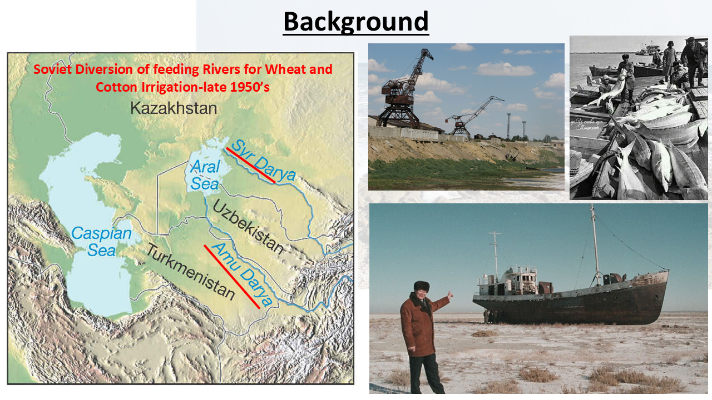
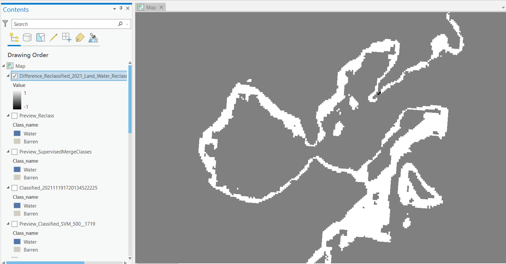
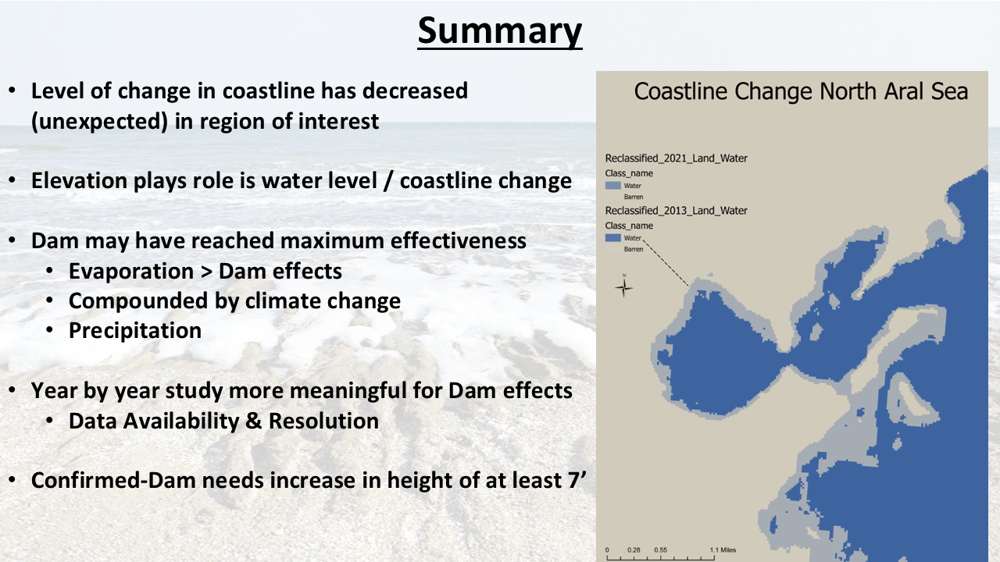

# Assessment of Coastline Recovery Following the Kok-Aral Dam Using Remote Sensing

## Overview

Can satellite imagery be used to evaluate the environmental effectiveness of large-scale water restoration projects?
This project applies GIS and remote sensing techniques to examine coastline changes in the North Aral Sea following construction of the Kok-Aral Dam in Kazakhstan.

The Kok-Aral Dam, completed in 2005, was designed to increase water retention within the North Aral Sea and mitigate some of the environmental consequences associated with decades of water diversion from the Syr Darya and Amu Darya Rivers. Using satellite imagery acquired during the post-dam period (approximately 2006–2019/2020), this analysis evaluates whether measurable changes in coastline position occurred within the study area.

This project represents an educational application of GIS and remote sensing methods rather than a definitive scientific assessment of dam effectiveness.

---

## Background

The desiccation of the Aral Sea is widely recognized as one of the most significant environmental transformations of the twentieth century. In response to ongoing ecological and socioeconomic concerns, Kazakhstan constructed the Kok-Aral Dam to improve water levels in the North Aral Sea.

This project focuses specifically on the period **following construction of the Kok-Aral Dam**, rather than the broader historical decline of the Aral Sea during the Soviet era.

---

## Research Questions

* Did the coastline of the North Aral Sea change during the period following construction of the Kok-Aral Dam?
* Can supervised classification techniques be used to identify changes in the extent of open water over time?
* What do the observed changes suggest regarding environmental conditions within the North Aral Sea?
* What limitations should be considered when using publicly available satellite imagery to assess environmental interventions?

---

## Methods

The analyses presented in this repository employed the following approaches:

* ArcGIS Pro workflows
* Acquisition of post-dam satellite imagery (approximately 2006–2019/2020)
* Supervised classification of water and non-water classes
* Development of training samples
* Raster-based change detection techniques
* Spatial visualization and cartographic presentation

---

## Repository Structure

```text
aral-sea-environmental-change/
├── images/      # Selected figures and maps
├── reports/     # Presentations and project reports
├── LICENSE
└── README.md
```

---

## Selected Results

### Study Area and Historical Context



### Training Sample Development


### Water Classification Results


### Coastline Change Detection



### Project Summary



---

## Interpretation and Limitations

The results suggest that measurable changes in coastline position occurred within the study area during the period examined. However, this project was not designed to establish a causal relationship between the Kok-Aral Dam and the observed changes.

Additional analyses incorporating hydrological data, multiple classification approaches, and longer temporal datasets would be necessary to evaluate dam effectiveness more rigorously.

---

## Reports

Additional project materials are available in the `reports` directory, including presentations and supporting documentation related to the analyses.

---

## Tools Used

* ArcGIS Pro
* Satellite imagery datasets
* Raster analysis techniques
* Supervised classification methods
* GIS-based change detection workflows

---

## Author

**Tariq Haniff**

GitHub: CentralAsiaAtlas

Interests: Central Asia • Environmental Change • GIS • Remote Sensing • Migration and Development

